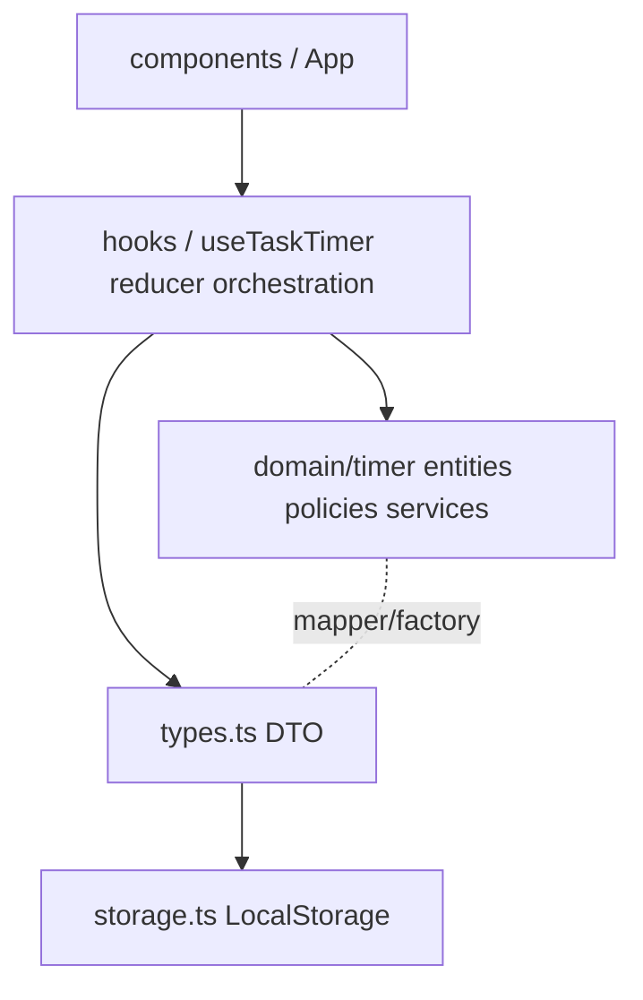

# アーキテクチャ設計

## 1. 目的とスコープ

このドキュメントは、どーなつタイマーの実装判断を素早く再確認できるようにするための設計メモです。  
対象はフロントエンド（React アプリ）と、ドメインロジック・永続化境界の責務分離です。

## 2. 技術スタック

- UI: React 19 + TypeScript + Vite
- アニメーション: Framer Motion
- テスト: Vitest + React Testing Library
- 永続化: LocalStorage

## 3. レイヤー構成

- `components/`: 画面表示とユーザー操作の入力のみ担当。
- `hooks/`, `useTaskTimer/reducer.ts`: 状態遷移のオーケストレーション担当。
- `domain/timer/`: ドメインルールの正本。UI 事情を持ち込まない。
- `types.ts`, `storage.ts`: アプリ境界（DTO/保存形式）の契約担当。

## 4. 依存方向ルール

1. UI は Domain へ直接依存せず、Hook/Reducer を経由する。
2. Domain は DTO 型に直接依存しない。
3. Domain と DTO の相互変換は Factory/Mapper に集約する。
4. Reducer でドメインロジックを再実装しない。

## 5. データモデル方針

- `src/domain/timer/model.ts`: ドメインの正規モデル。
- `src/types.ts`: UI/Storage 境界の DTO。
- 変換責務:
  - DTO -> Domain: `src/domain/timer/factories/`
  - Domain -> DTO: `src/domain/timer/mappers/`

この分離により、UI 表示都合や保存都合がドメインルールへ侵入するのを防ぎます。

## 6. 主要ユースケースのデータフロー

### 6.1 タイマー進行

1. UI 操作を Hook が受ける。
2. Reducer がユースケースを選択する。
3. Domain policy/service が判定・計算する。
4. 必要に応じて DTO へ変換し、UI 状態へ反映する。

### 6.2 モード遷移（ごほうび/目標時刻）

1. モード変更入力を受ける。
2. `domain/timer/services/modeTransition.ts` で遷移判定する。
3. 互換性を保った DTO に写像して表示更新する。

### 6.3 セッション保存/復元

1. 実行中状態を DTO 化して LocalStorage へ保存する。
2. 復元時は DTO を読み込み、Factory で Domain へ戻す。
3. 実行継続可否の判定を service/policy で行う。

## 7. DDD 配置原則

- `entities/`: 個別概念の不変条件と状態遷移。
- `policies/`: 複数 Entity をまたぐ計算・判定（例: ごほうび計算）。
- `services/`: セッション復元やモード遷移などユースケース合成。
- `useTaskTimer/reducer.ts`: 上記を呼び出すオーケストレーション。

## 8. 互換性方針

- LocalStorage の既存フォーマットは維持する。
- 仕様変更が必要な場合は境界変換で吸収し、公開契約の破壊を避ける。

## 9. テスト戦略

1. 新しいドメインルールは `entities/` または `policies/` のユニットテストを先に追加する。
2. reducer テストは非回帰確認に集中する。
3. UI テストは主要操作フローの崩れ検知を目的に最小限で維持する。

## 10. 関連ドキュメント

- [ユビキタス言語定義](../UBIQUITOUS_LANGUAGE.md)
- [ADR 一覧](./decisions/README.md)
- [変更履歴](../CHANGELOG.md)
